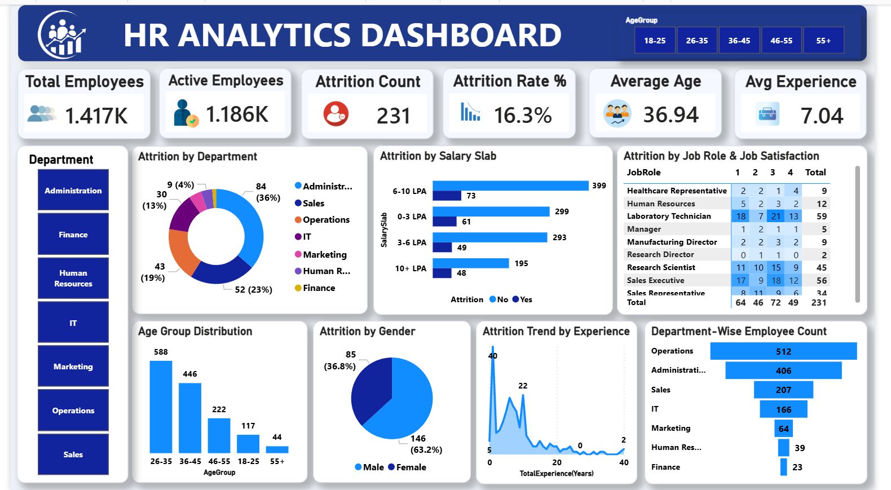

# 📊 HR Analytics Dashboard | Power BI


---

# Dashboard Preview



---

# Project Overview

The **HR Analytics Dashboard** is an interactive Business Intelligence solution developed in **Power BI** to analyze workforce data and employee attrition.

The dashboard enables HR teams to monitor employee demographics, attrition trends, salary distribution, job satisfaction, and department-wise workforce performance through dynamic visualizations and KPI reporting.

---

# Business Problem

Employee attrition significantly impacts productivity, recruitment costs, and organizational performance.

This dashboard helps HR professionals answer questions such as:

- Which departments have the highest attrition?
- Which salary groups experience higher turnover?
- What is the overall attrition rate?
- Which age groups are leaving the company?
- How does job satisfaction relate to employee attrition?
- Which departments have the largest workforce?

---

# Dataset Information

| Item | Details |
|------|---------|
| Records | 1,470+ Employees |
| Columns | 37 |
| Format | CSV |
| Source | HR Employee Dataset |

---

# Tools & Technologies

- Power BI Desktop
- Power Query
- DAX
- CSV Dataset
- Data Modeling

---

# Dashboard KPIs

- 👥 Total Employees
- ✅ Active Employees
- ❌ Attrition Count
- 📉 Attrition Rate
- 🎂 Average Age
- 💼 Average Experience

---

# Dashboard Features

- Department-wise Attrition Analysis
- Salary Slab Analysis
- Employee Age Distribution
- Gender-wise Attrition
- Job Satisfaction Matrix
- Department Employee Count
- Experience Trend Analysis
- Interactive Department Filter
- Age Group Slicer

---

# Data Cleaning

Performed using Power Query:

- Removed duplicate records
- Checked missing values
- Corrected data types
- Created Age Groups
- Created Salary Slabs
- Renamed columns
- Standardized categorical values

---

# DAX Measures

```DAX
Total Employees =
COUNT(HR[EmpID])

Attrition Count =
CALCULATE(
COUNT(HR[EmpID]),
HR[Attrition]="Yes"
)

Active Employees =
[Total Employees]-[Attrition Count]

Attrition Rate =
DIVIDE([Attrition Count],[Total Employees])

Average Age =
AVERAGE(HR[Age])

Average Experience =
AVERAGE(HR[TotalExperienceYears])
```

---

# Business Insights

- Overall employee attrition rate is **16.3%**
- Operations department has the highest employee count.
- Employees in lower salary slabs show higher attrition.
- Most employees belong to the **26–35** age group.
- Male employees represent the majority of the workforce.
- Job satisfaction influences employee retention.

---

# Repository Structure

```
HR-Analytics-Dashboard-PowerBI
│
├── Dashboard
│   └── HR_Analytics_Dashboard.pbix
│
├── Dataset
│   └── HR_Analytics_Dataset.csv
│
├── Images
│   ├── HR_Dashboard.png
│   ├── Total_Employees.jpg
│   ├── Active_Employees.jpg
│   ├── Attrition_Count.jpg
│   ├── Attrition_Rate.jpg
│   ├── Average_Age.jpg
│   └── Average_Experience.jpg
│
├── README.md
└── LICENSE
```

---

# Project Workflow

```
CSV Dataset
      │
      ▼
Power Query
(Data Cleaning & Transformation)
      │
      ▼
Data Modeling
      │
      ▼
DAX Measures
      │
      ▼
Interactive Dashboard
      │
      ▼
Business Insights
```

---

# Skills Demonstrated

- Data Cleaning
- Data Transformation
- Data Modeling
- DAX
- Power Query
- Power BI
- Dashboard Design
- Data Visualization
- Business Intelligence
- KPI Reporting
- HR Analytics

---

# Future Enhancements

- Monthly Attrition Trend
- Employee Performance Dashboard
- Recruitment Analytics
- Predictive Attrition Analysis
- Drill-through Reports

---

# Author

## Hanumantha B

**Aspiring Data Analyst**

### Connect with me

**LinkedIn**

https://www.linkedin.com/in/hanumantha-b-673938374

**GitHub**

https://github.com/hanumanth112

---

⭐ If you found this project helpful, consider giving it a star!
